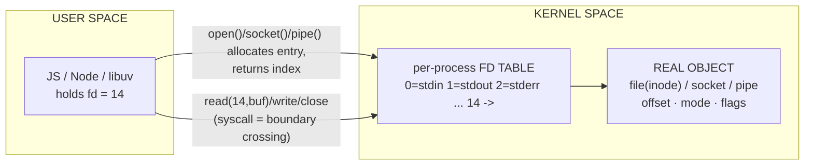
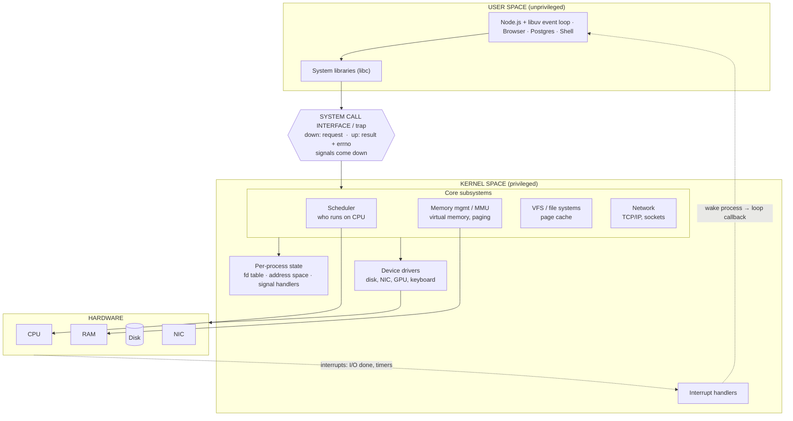
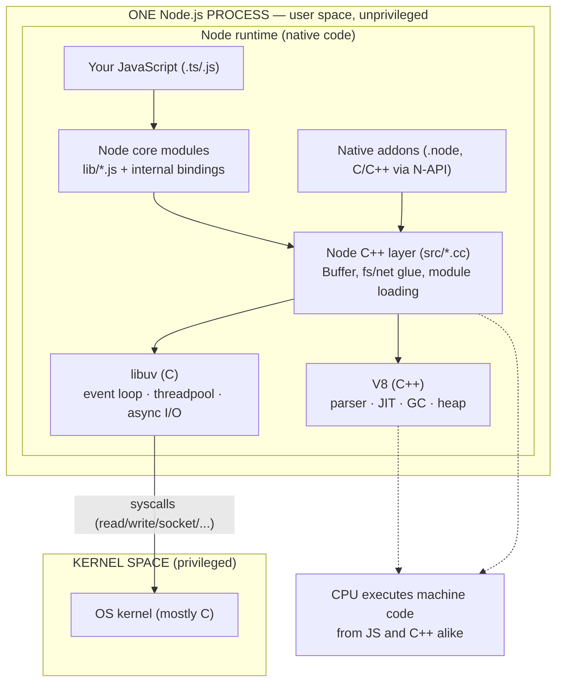
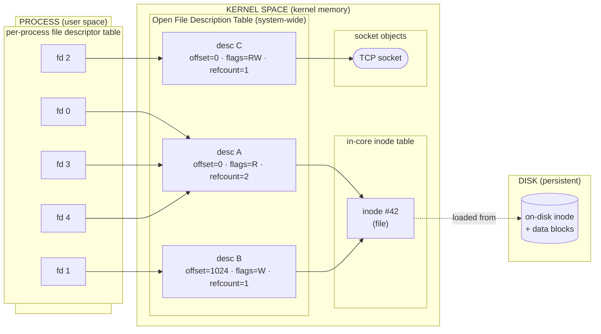

# Diagrams

Shareable diagrams for topic 0. Each has a plain-language caption (so it stands alone if
you paste it elsewhere), a Mermaid source, and an ASCII fallback where useful. Diagrams
describe Linux/Unix-style kernels; details vary on Windows/macOS.

---

## 1. File descriptors — the handle on the user/kernel boundary

> Model: a *process* owns resources. A *file descriptor* (fd) is a small integer held in
> **user space** that names an I/O resource the **kernel** manages. The kernel keeps a
> per-process table mapping each fd number to the real object. System calls are the only way
> across the boundary. Threads in one process share the fd table; separate processes have
> separate tables. `RLIMIT_NOFILE` caps the table size.

```
        USER SPACE                         │            KERNEL SPACE
                                           │
  your JS / Node / libuv                   │
        │                                  │
        │  holds an integer, e.g. fd = 14  │
        ▼                                  │
   fd = 14  ────────── read(14, buf) ──────┼──►  per-process FD TABLE
        ▲                                  │        ┌──────┬───────────────────────────┐
        │      (syscall = the boundary     │        │  0   │ stdin  ┐                   │
        │       crossing)                  │        │  1   │ stdout │ set up at startup │
        │                                  │        │  2   │ stderr ┘                   │
        │                                  │        │ ...  │                           │
        │                                  │        │  14  │ ──► open file description  │
        │                                  │        │ ...  │     (offset, mode, flags)  │
        │   open()/socket()/pipe() ALLOCATE│        └──────┴──────────┬────────────────┘
        │   an entry & RETURN its index    │                          ▼
        │   read()/write()/close() LOOK UP │                   REAL OBJECT
        │   the index and act on it        │              file(inode) · socket · pipe
```



Key facts: the number lives in the process, the table entry + object live in the kernel ·
fds are per-process (`0/1/2` = stdin/stdout/stderr) · threads share the table, so a leaked
fd in any worker counts against the whole process · `RLIMIT_NOFILE` caps the table
(`EMFILE` when full) · entries are per-process but the underlying object can be shared
(`fork`, `dup`, passing an fd over a Unix socket).

---

## 2. User space / kernel space / hardware

> Model: programs run in **user space** (unprivileged); the **kernel** runs in kernel space
> (privileged) and is reached only through the **system call interface** (a CPU mode
> switch). Requests go **down** (syscalls); results and **interrupts** go **up**. The
> scheduler drives the CPU and memory management drives RAM directly — only *other* devices
> go through drivers. Interrupts are the async path: hardware signals completion, the
> kernel handles it and wakes the process, which is what drives the Node event loop.



---

## 3. Where C++ lives — inside the process, still user space

> Model: C++ is **not** a layer above user space — it *is* user space. Language doesn't
> decide privilege; the user/kernel split does. One Node process contains your JS, Node's
> C++ bindings, V8 (C++), libuv (C) and any native addons — all unprivileged. They reach
> the kernel only via syscalls, exactly like JS. Only the kernel runs privileged. (The
> Linux kernel is mostly **C**, not C++; JS compiled by V8 and hand-written C++ both run as
> machine code on the CPU.)



Why it matters:

- A bug/segfault in native code (addon, V8, Node's C++ layer) takes down the **whole
  process** — there's no isolate protecting it. JS errors are contained by the engine.
- `Buffer`/`TypedArray` memory, the threadpool, and `import`/module loading all live in this
  native layer, which is why they have limits JS can't change.
- Debugging profiles can show both JS frames and native frames; `--cpu-prof` and perf see
  the C++ stacks too.

Sources: Node.js *C++ addons* <https://nodejs.org/api/addons.html>, *Node-API*
<https://nodejs.org/api/n-api.html>, *V8* <https://nodejs.org/api/v8.html>, *libuv*
<https://docs.libuv.org/en/v1.x/design.html>.

---

## 4. Three-level indirection: fd → open file description → file / socket

> Model (classic Unix): a process's **fd table** maps small integers to **open file
> descriptions** in a system-wide **open file description table**; each description records
> the file offset, status flags and access mode and points to a kernel object — an
> **in-core inode** (file) or a **socket** (network fd). Two fds can share one description
> (`dup`, `fork` → *shared* offset/flags). Two descriptions can share one inode (two
> `open()`s → *independent* offsets). In-core inodes are loaded from the on-disk inode;
> sockets exist only in kernel memory. One description points to exactly **one** object.



Key points: fd numbers are per-process, descriptions are system-wide (shared by fork/dup),
and the object behind a description is shared (`dup` → same offset; separate `open` → new
offset). This is why `dup2`/`fork` share file position but two `open()`s don't. — Linux
`open(2)` <https://man7.org/linux/man-pages/man2/open.2.html>, `dup(2)`
<https://man7.org/linux/man-pages/man2/dup.2.html>; Kerrisk, *The Linux Programming
Interface* ch. 5.

---

## Official upstream diagrams (canonical)

When you want a diagram that upstream maintains (not ours):

- **libuv — *Design overview*** (official). Two diagrams: the components/architecture, and
  the event-loop iteration stages. Docs page
  <https://docs.libuv.org/en/latest/design.html>; source images in the libuv repo,
  `docs/src/static/architecture.png`
  <https://raw.githubusercontent.com/libuv/libuv/v1.x/docs/src/static/architecture.png> and
  `docs/src/static/loop_iteration.png`
  <https://raw.githubusercontent.com/libuv/libuv/v1.x/docs/src/static/loop_iteration.png>.
  This is the closest thing to an "official Node async architecture" diagram, since Node's
  event loop and threadpool *are* libuv.
- **V8 — *High-Level Overview*** (official; the execution pipeline: Ignition → Sparkplug →
  Maglev → TurboFan/Turboshaft, plus key components). No single block diagram, but it's the
  official description: <https://github.com/v8/v8/blob/main/docs/overview.md>. Per-subsystem
  "Architecture" deep-dives: <https://chromium.googlesource.com/v8/v8/+/main/docs>.
- **Node.js** — no official layered architecture diagram. The official *event loop* guide is
  prose: <https://nodejs.org/en/learn/asynchronous-work/event-loop-timers-and-nexttick>.
- **OS / kernel** — no canonical upstream block diagram. Standard references: OSTEP
  (textbook figures) <https://pages.cs.wisc.edu/~remzi/OSTEP/> and the Linux kernel docs
  <https://www.kernel.org/doc/html/latest/>. The well-known "Linux Kernel Map" is
  community-made, not official.
