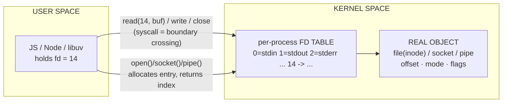

```mermaid
flowchart LR
    subgraph User["USER SPACE"]
        JS["JS / Node / libuv<br/>holds fd = 14"]
    end
    subgraph Kernel["KERNEL SPACE"]
        Table["per-process FD TABLE<br/>0=stdin 1=stdout 2=stderr ... 14 -> ..."]
        Obj["REAL OBJECT<br/>file(inode) / socket / pipe<br/>offset · mode · flags"]
    end
    JS -- "read(14, buf) / write / close<br/>(syscall = boundary crossing)" --> Table
    Table --> Obj
    JS -- "open()/socket()/pipe()<br/>allocates entry, returns index" --> Table
```
